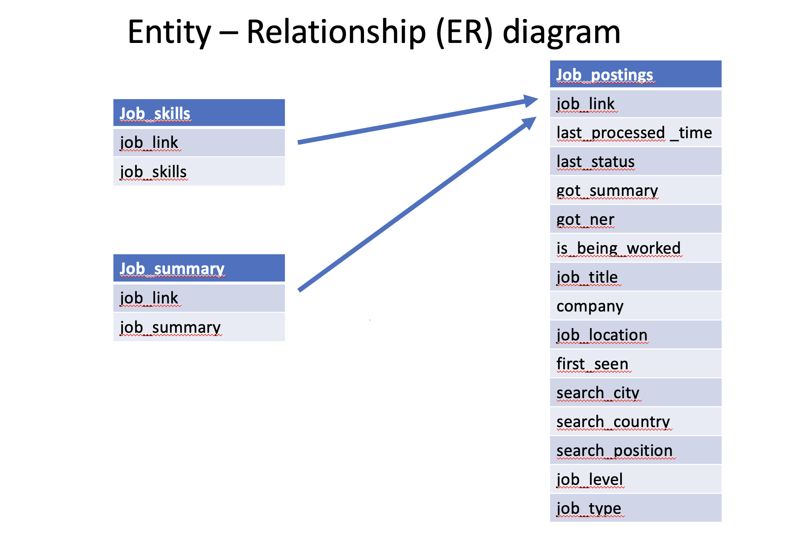

```{r setup, include=FALSE}
knitr::opts_chunk$set(echo = TRUE)
```

# First Part of Project 3

Create a short document, with the names of group members. You should briefly describe your collaboration tool(s) you’ll use as a group, including for communication, code sharing, and project documentation. You should have identified your data sources, where the data can be found, and how to load it. And you should have created at least a logical model for your normalized database, and produced an Entity-Relationship (ER) diagram documenting your database design.
</br>

## Team Members: 

* Natalie Kalukeerthie
* Anna Moy
* Bishoy Sokkar
</br>

## Collaboration tools:

**Communication**: Slack, Zoom, Google doc and email

**Code Sharing**: Github, Google doc and email

**Project Documentation**: R Markdown, Rpubs, and PDF

**Data Source**: Kaggle [(Data Science Job Postings & Skills 2024)]( https://www.kaggle.com/datasets/asaniczka/data-science-job-postings-and-skills?select=job_postings.csv)

</br>

**Normalized Data**: 

First step is to download the dataset file from Kaggle and load all three csv files into Github. We will need to merge all three files into one dataset and then tidy up the data. 
We will need to split up data in the columns for job_location into (city, state, country) in order to accurately categorize and group our data. The job_skills column has all the job skills grouped together, so we will need to split the data into individual observations. 

These are our initial questions regarding the dataset:

* What skills are the most common for data scientist?
    
* What skills are needed for data scientist at different countries?

* What skills are needed for data scientist depending on their level of seniority?
  

 

